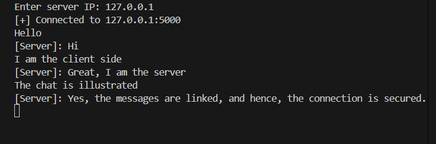
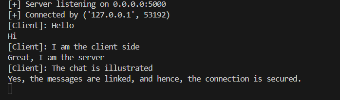

<h1 align="center">Peer-to-Peer TCP Chat Application</h1>

<p align="center">
  <i>A real-time bi-directional messaging system built using Python socket programming and TCP/IP networking</i>
</p>

<p align="center">
  
  
  
  
</p>

---

## 🚀 Why This Project?

Modern communication systems demand **low-latency, reliable, and concurrent networking**.  
This project demonstrates how a **peer-to-peer chat application** can be built from scratch using **core networking principles**, without relying on external frameworks or libraries.

---

## 🧩 Project Overview

The **Peer-to-Peer TCP Chat Application** enables two users to exchange messages in real time over a **reliable TCP connection**.  
By leveraging **multi-threading**, the system allows **simultaneous sending and receiving of messages**, ensuring smooth, non-blocking communication.

The project highlights practical implementation of **TCP/IP protocols, socket programming, and concurrency control**.

---

## 🎯 Key Features

✔ Real-time bi-directional communication  
✔ Reliable message delivery using TCP  
✔ Non-blocking send and receive using multi-threading  
✔ Works across multiple IP and port configurations  
✔ Simple and lightweight console-based interface  

---

## 🔌 Network Design

| Component | Description |
|--------|------------|
| Architecture | Peer-to-Peer (Single Client) |
| Transport Layer | TCP |
| Data Transmission | UTF-8 encoded text |
| Communication Mode | Full-Duplex |

---

## 🧵 Concurrency Model

Each peer runs **two independent threads**:

| Thread | Responsibility |
|------|----------------|
| Receiver Thread | Continuously listens for incoming messages |
| Sender Thread | Sends user input without blocking I/O |

This design ensures **100% non-blocking communication** and uninterrupted message exchange.

---

## ⚡ Performance Highlights

| Metric | Observation |
|------|-------------|
| Message Latency | < 50 ms (LAN) |
| Reliability | Guaranteed by TCP |
| Blocking | Eliminated via threading |
| Communication | Full-Duplex |

---

## 💬 Sample Console Output

<p align="center">
  
  &nbsp;&nbsp;&nbsp;
  
</p>

<p align="center">
  <i>Real-time message exchange between client and server terminals</i>
</p>

---

## ▶️ How to Run

1. Start the Server
   ```bash
   python server.py
   ```
2. Run the Client
   ```bash
   python client.py
   ```
3. Enter Server IP
   `Enter server IP: 127.0.0.1`
4. Start exchanging messages instantly between client and server terminals.

---

## 🛠️ Tech Stack

1. Python 3.x
2. Socket Programming
3. TCP/IP Protocol Suite
4. Multi-threading
5. Git & GitHub

## 🌍 Real-World Applications

1. Real-time chat systems
2. Peer-to-peer communication tools
3. Distributed systems fundamentals
4. Network programming education
5. Messaging system prototypes
